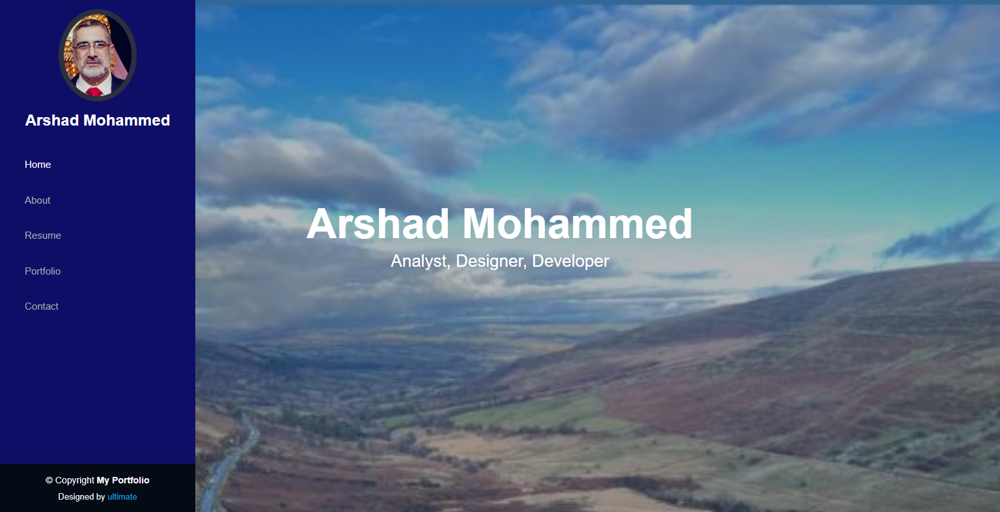
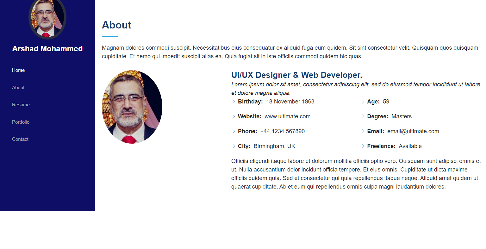
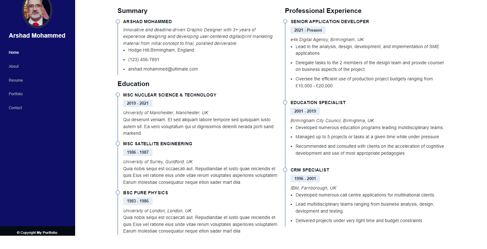
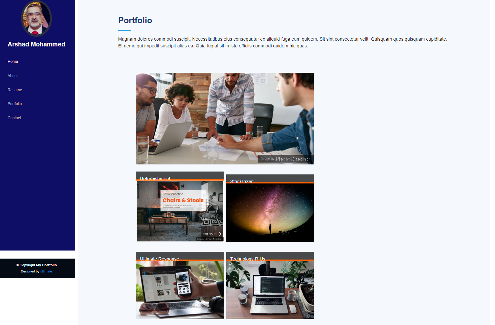
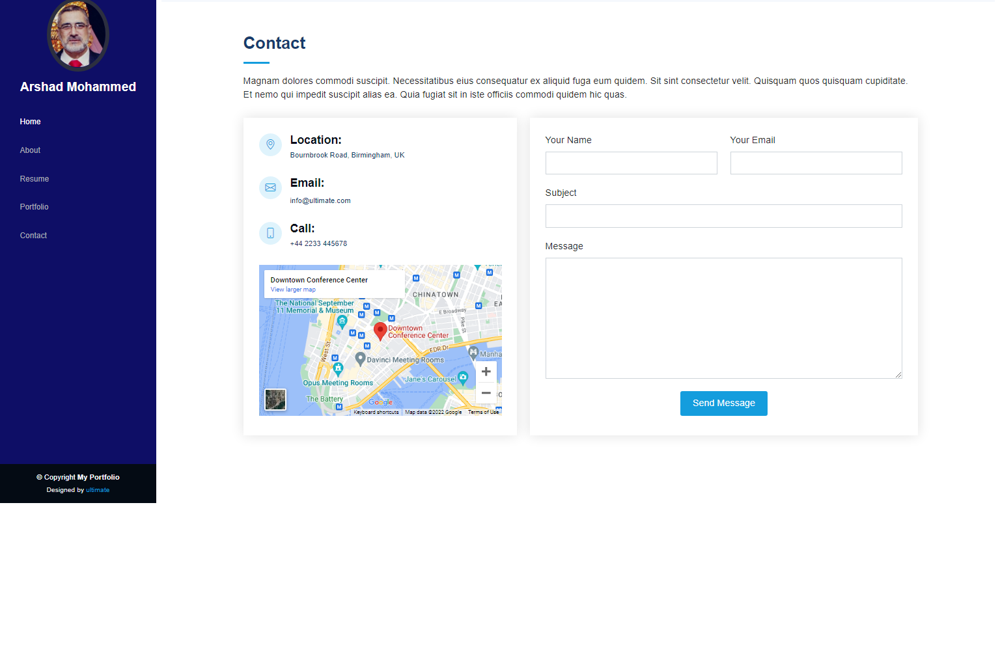

# MyPortfolio
This project is intended to provide an introduction to the frontend developer. The portfolio showcases the educational and technical background and provides access to some of the projects completed by hte professional to gauge the technical skills. The portfolio is divided into five sections as follows:

1. **Home** - Title page with navigation
2. **About** - Snapshot of developers background and contact details.
2. **Resume** - More detailed account of education and career.
3. **Portfolio** - links to recent project completed.
4. **Contact** - Provides some contact details.

## Home Page
The homepage provides a small image of the developer in the left hand panel. The user can click on the links provide in the left hand panel to navigate to the desired section e.g. click on "Resume" to navigate to the resume section (see image below).

## About Page
This page provides a developer snapshot. There is a small photo of the developer together with some personal and contact details. The page images is provided below:

## Resume Page
This page displays the highest levels of educational qualifications held by the developers and it also provides details of the most relevant jobs held.

## Portfolio
This is perhaps most important part as it provides links to the most recent projects completed by the developer and provides an insight into the skills possessed by the developer for potential clients or employers. 

## Contact page
Multi channel contact details for the developer are provided in this section. There is also a form to send a message to the developer.

This project was put together using simple css html and some bootstrap grid functionality. The project shows how an interesting presentation can be put together with some basic technical skills. inspiration was drawn from various portfolio examples on the web. 